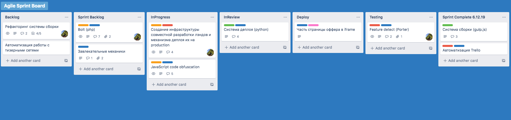

## Kanban guide

Канбан - это метод управления процессом разработки, базирующийся на визуализации нематериальной деятельности и 
ограничении количества незавершенной работы. Канбан делает работу нагляднее, а управление процессом разработки эффективнее.

Что бы контроллировать выполнение задач было проще, процесс визуализируют на доске, разделенной на несколько колонок. 
В самом простом варианте это колонки **Backlog**, **Todo**, **InProgress** и **Done**. Но можно добавлять дополнительные колонки для более 
детального контроля потока, выделяя технологические этапы (**InReview**, **Acceptance**), либо для внедрения смежных практик из 
других подходящих методологий (**Sprint Backlog**, **SprintComplete**).

### Flow

Все поступающие задачи размещаются в **Backlog**, где проходят этапы подготовки и оценки. 
Оцененные и описанные задачи попадают в список **Todo**, где занимают свое место согласно приоритету.
Как только разработчик приступает к работе над очередной задачей, соответствующая карточка переносится в **InProgress**.

Важное правило - соблюдать количество задач одновременно находящихся в статусе **InProgress**. 
Точный максимум определяют исходя из возможностей коллектива, опыта и анализа предыдущих экспериментальных итераций.
Взяться за следующую задачу разработчик может только завершив работу с предыдущей.

_Это ограничение стимулирует активное сотрудничество членов команды,_
_провоцирует обсуждение производственных вопросов и способов их решения._

В зависимости от регламента команды, задача, после фактического выполнения, попадает либо в **Done**, либо в один 
из следующих технологических этапов, определенных командой в **Definition of Done**. 

#### Definition of Done
Определяет всю цепочку этапов, через которые проходит задача, устанавливая правило, по которому любой член команды
понимает, что задача закрыта. Основная цель - синхронизировать понятие **Done** между всеми членами команды.
Команды, работая над **Definition of Done**, часто выделяют дополнительные технологические этапы, 
такие, как **Code Review**, **Testing**, **Deploy**.

В жизни каждой команды может случиться неприятная ситуация, когда задача фактически в **Done**, но бизнес не устраивает 
реализация и требуется внести правки, иногда противоречащие текущему концепту решения и/или требующие вложения 
большого количества ресурсов.  На помощь приходят такие артефакты **Agile** фреймворка **Scrum**, как 
**Acceptance Criteria** и **Definition of Ready**.

#### Acceptance Criteria
Определяет необходимые условия реализации программного продукта, при которых он может быть принят стейкхолдером или 
другой системой. Представляет собой формализованный список требований, в процессе определения которого команда 
и стейкхолдер устанавливают ограничения, достигают консенсуса, синхронизируют понимание процессов и ценностей.
**Acceptance Criteria** могут так же быть базисом для тестов. 

[Рекомендуется к прочтению](https://rubygarage.org/blog/clear-acceptance-criteria-and-why-its-important)

#### Definition of Ready
Определяет критерии готовности задачи к взятию в работу. **Definition of Ready** позволяет избежать начала работы над 
задачами, не имеющими ясного определения **Acceptance Criteria**, а так же имеющими расхождения в понимании, как внутри 
команды, так и между командой и стейкхолдером.

[Рекомендуется к просмотру](https://www.youtube.com/watch?v=XkhJDbaW0j0)  

###  Tips & Tricks

- **Визуализируй** - декомпозируй задачи и распредели их

- **Ограничивай объем незавершенной работы** - вычисли необходимый лимит незавершенных задач на каждом этапе

- **Оптимизируй** - измеряй время выполнени каждой задачи, анализируй процесс, прогнозируй результат

- **Экспериментируй** - используй практики и артефакты из других фреймворков и методологий

_Специально для_ [`Elama Junior Lab` :runner:](https://juniorlab.ru/)

